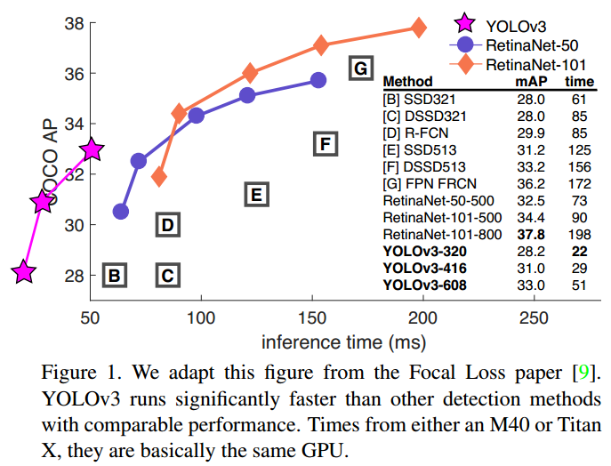
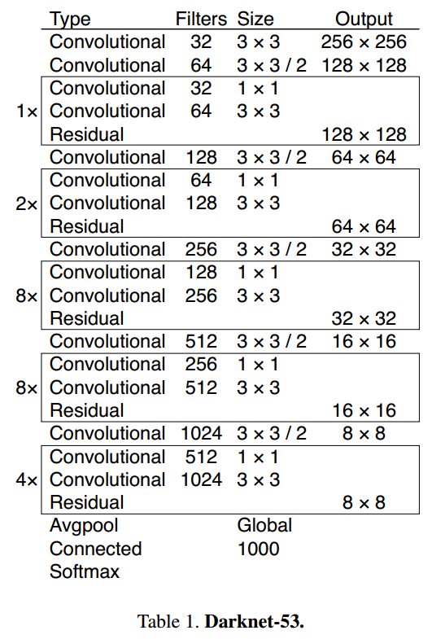
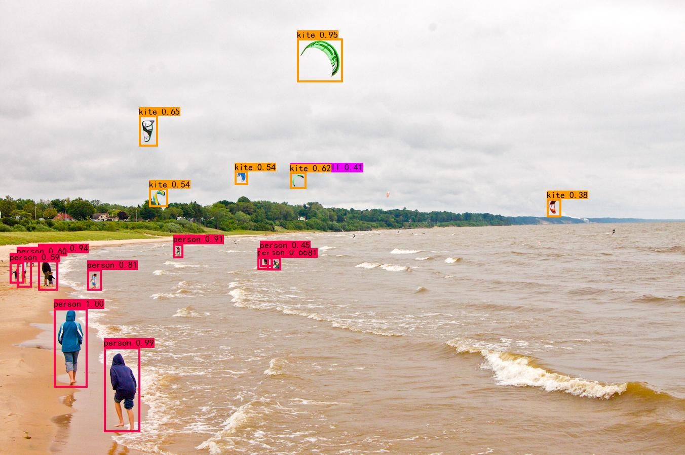
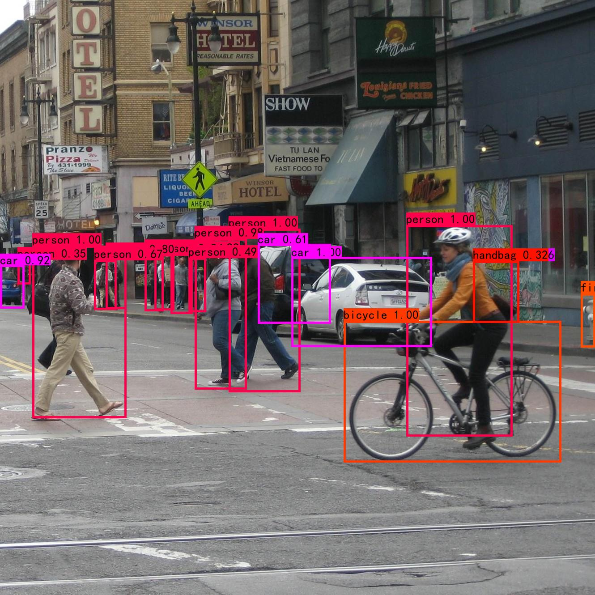

## YOLOv3: An Incremental Improvement  

## implemented by keras and tensoeflow  

### Danger Sources Intelligently Detection System Based on YOLOv4


---

### Content
1. [Environment](#environment)
2. [How2train](#training your own dataset)
3. [what is yolov4](#yolov4)
4. [Evalute]()
5. [Do in future]()

### Environment

windows10(you also can run these codes on linux)
tensorflow-gpu==1.13.1  
keras==2.2.4  


### Train Your Own Dataset
1、label you dataset in VOC format and use VOC development toolkit  
2、put your image dataset in yolo3-keras-techi/VOCdevkit/VOC2088/JPEGImages  
3、put your label files in yolo3-keras-techi/VOCdevkit/VOC2088/Annotations   
4、run voc_annotation.py to generate true label files

```python
classes = ["warning sign", "no reflective cloth", "reflective cloth", "staircase", "insulating tool", "tool"]
```
6、modify voc_classes.txt to class names in your project  
7、run train.py  
```
python train.py
```
8、tune parameters in configs.py to make your model be start-of-art

### Evaluation By mAP
1、run get_gt_txt.py to get ground truth of valid dataset 
```
python get_gt_txt.py
```
2、run get_dr_tex.py to get detecting results of valid dataset
```
python get_dr_tex.py
```
3、run get_map.py to get mAP0.5 of your model  
```
python get_map.py
```

### what is YOLOv3?
YOLOv3 is a object model as accuracy as SSD but 3 times faster.
1.YOLOv3 use independent logistic classifiers because a softmax is unnecessary for good performance.

2.YOLOv3 predicts boxes at 3 different scales. And use K-means clustering to determine our bounding boxes priors.

On the COCO datasets the 9 clustera  were: (10× 13); (16× 30); (33× 23); (30× 61); (62× 45); (59×119); (116 × 90); (156 × 198); (373            × 326).  

3.New feature extractor named DarkNet53.
### what are YOLOv3 trying but not working?
1.We tried using the normal anchor box prediction mechanism where you predict the x; y offset as a multiple of the box width or height using a linear activation. We found this formulation decreased model stability and didn’t work very well.
2.Linear x; y predictions instead of logistic. We tried using a linear activation to directly predict the x; y offset instead of the logistic activation. This led to a couple point dop in mAP.
3.**Focal loss:using focal loss will drop accuracy and i use it in my project where i find using focal loss does not help make my model better.**
4.Dual IOU thresholds and truth assignment. Faster RCNN uses two IOU thresholds during training. If a prediction overlaps the ground truth by .7 it is as a positive example, by [:3−:7] it is ignored, less than .3 for all ground truth bjects it is a negative example. We tried a similar strategy ut couldn’t get good results.

<p align="center"></p>
<p align="center"></p>

#### Result(use coco pretrained model)

<p align="center"></p>
<p align="center"></p>

### TODO
- [x] Transfer Learning
- [x] multi-scale prediction
- [x] Data Aug
- [x] Diou
- [x] Ciou
- [x] Focal loss
- [ ] label smooth(i do not recommend to use label smooth in object detection, you can use it in single classifier task)
- [ ] ATSS [Adaptive Training Sample Selection]()
- [x] Mish
- [ ] MixUp
- [ ] Genetic Algorithm
- [x] WBF(Weighted-Boxes-Fusion)  postprocess <https://arxiv.org/abs/1910.13302>
- [x] soft NMS
- [x] Gaussian YOLOv3
- [x] ASFF
